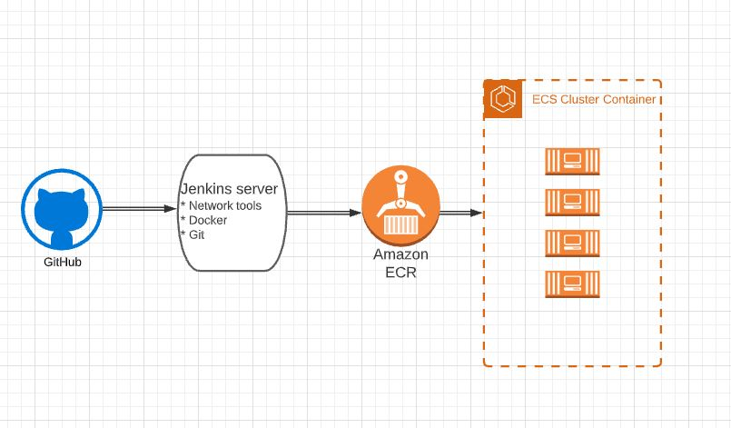

- Automating builds
- Automating Docker image builds
- Automating Docker image upload into AWS ECR
- Automating Docker container provisioning

Server with installed Jenkins, Docker pulls the code from the GitHub repo\
Once the user pulls the code to the Git, works trigger/webhook.\
Jenkins builds the Docker image and pulls to AWS ECR\

For reference:\
IAM role with AmazonEC2ContainerRegistryFullAccess policy, attach to Jenkins EC2 instance\
Jenkins - Aws credentials plugin\
GitHub Auth through ssh\
